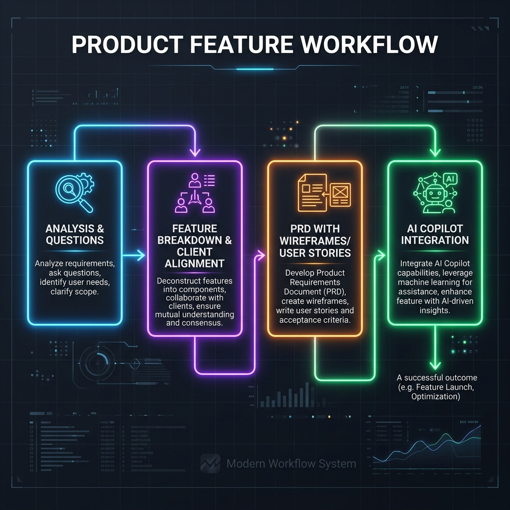

# 🛒 Amaze Advanced Product Search Engine — Project Overview

Tài liệu này trình bày chi tiết về quy trình phân tích nghiệp vụ, thiết kế giải pháp và phát triển tính năng **Tìm kiếm Sản phẩm Thông minh (Smart Product Search)** cho nền tảng thương mại điện tử B2B/B2C đa quốc gia.

---

## 🎯 Mục Tiêu & Ngữ Cảnh Dự Án (Introduction)
Dự án được xây dựng nhằm giải quyết bài toán tìm kiếm sản phẩm đa ngôn ngữ (Anh - Thái - Việt), tự động tối ưu hóa hiển thị sản phẩm quảng cáo (Ad Bidding) và giảm thiểu tối đa tỷ lệ tìm kiếm không ra kết quả (Zero-Results Rate). Quy trình thực hiện dưới đây bám sát mô hình phát triển **Agile**, hướng tới việc làm rõ yêu cầu nhanh chóng và cộng tác hiệu quả với khách hàng/sếp thông qua các công cụ trực quan.

---

## 🔄 Quy Trình Làm Việc Khi Triển Khai Tính Năng Mới (Feature Workflow)

Quy trình làm việc từ đầu đến cuối được trực quan hóa qua sơ đồ dưới đây:

### 1️⃣ Phân tích & Đặt câu hỏi làm rõ (Analysis & Clarifying)
* **Nội dung:** Đọc hiểu yêu cầu sơ bộ, phân tích các trường hợp biên (edge cases) và lập danh sách câu hỏi phản biện để thống nhất với các bên liên quan.
* **Tài liệu bàn giao:** 📝 **[Open Questions & Clarifications](open_questions.md)** (Danh sách câu hỏi mở rộng nhằm làm rõ nghiệp vụ trước khi thiết kế).

### 2️⃣ Phân tách tính năng & Catch-up với Client (Feature Breakdown & Client Alignment)
* **Nội dung:** Bẻ nhỏ kiến trúc hệ thống và luồng dữ liệu (data flow) thành các vùng trải nghiệm trực quan giúp khách hàng dễ hình dung giải pháp mà không cần đọc văn bản dài dòng.
* **Sản phẩm trình diễn trực quan (Live Demo):** 
  * 📈 **[Business Value Presentation (Click to View)](https://huy.do.pages.kyanon.digital/search_engine/index.html)** *(Trang tương tác trực quan hóa luồng nghiệp vụ trên trình duyệt).*
  * 🛠️ **[System Architecture Map (Click to View)](https://huy.do.pages.kyanon.digital/search_engine/architecture.html)** *(Sơ đồ kiến trúc luồng kỹ thuật từ API Gateway đến Database).*

### 3️⃣ Đặc tả tài liệu PRD & Chia phase MVP (PRD & MVP Planning)
* **Nội dung:** Soạn thảo tài liệu đặc tả yêu cầu nghiệp vụ (BRD/PRD) chi tiết bao gồm User Stories, tiêu chí nghiệm thu (Acceptance Criteria) viết bằng ngôn ngữ Gherkin (Given-When-Then), phân chia rõ ràng những gì nằm trong pha MVP (Sprint 1-2) và các pha tiếp theo.
* **Tài liệu đặc tả chi tiết:** 📄 **[Business Requirements Document (BRD)](product_search_requirements.md)** *(Đọc trực tiếp trên GitLab hoặc tải file về máy).*

---

## 🤖 Kỹ Năng Sử Dụng AI Trong Dự Án (AI Copilot Integration)

Dự án này ứng dụng AI làm trợ lý đồng hành xuyên suốt quá trình thiết kế tài liệu và xây dựng mockup.

### 1. Các AI Skills được sử dụng để tối ưu hiệu suất:
* **`effective-html`** (`npx skills add plannotator/effective-html`):
  * *Hiệu quả:* Tạo nhanh các trang slide/sơ đồ HTML tương tác cao, giúp khách hàng nước ngoài và sếp hiểu nhanh kiến trúc hệ thống mà không cần đọc tài liệu kỹ thuật khô khan.
  * *Output:* Trang HTML tương tác [search_business_presentation.html](search_business_presentation.html).
* **`grill-me`** (`npx skills@latest add mattpocock/skills --skill grill-me`):
  * *Hiệu quả:* Thực hiện phỏng vấn phản biện sâu với AI để phát hiện các lỗ hổng nghiệp vụ và hoàn thiện đặc tả.
  * *Output:* Tài liệu câu hỏi mở rộng [open_questions.md](open_questions.md).

### 2. Quy trình cộng tác với AI khi làm tài liệu nghiệp vụ (BRD):
Quy trình làm việc với AI được thiết kế chặt chẽ qua các bước:
1. **Đưa ra yêu cầu rõ ràng (Clear Requirements):** Cung cấp ngữ cảnh, mục tiêu kinh doanh và mô hình Agile cho AI.
2. **AI tạo bản phác thảo đầu tiên (Initial Draft):** Nhận bản thảo khung BRD cơ bản.
3. **Đọc, review và đánh giá (Review & Evaluate):** Đánh giá tính thực tế của các stories và tiêu chí nghiệm thu.
4. **Prompt điều chỉnh & cập nhật (Feedback Loop):** Yêu cầu AI sửa lỗi, dịch thuật sang tiếng Anh thân thuộc và cập nhật luật xếp hạng.
5. **Minh chứng lịch sử tương tác (Evidence Logs):** 🤖 **[AI Collaboration & Prompt Log](ai_collaboration_log.md)** *(Nhấp vào để xem chi tiết các câu lệnh prompt và phản hồi từ AI).*
