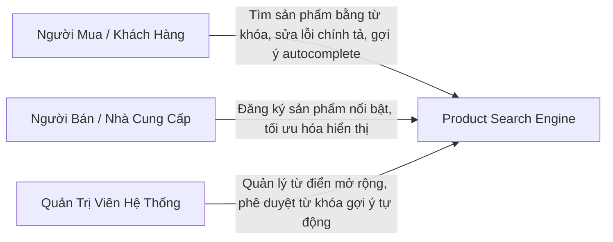

# 🛒 Amaze Advanced Product Search Engine
## Tài Liệu Đặc Tả Yêu Cầu Nghiệp Vụ (Business Requirement Document - BRD)

---

## 1. Mục Tiêu Dự Án & Chỉ Số Đánh Giá (Business Goals & KPIs)

Hệ thống **Amaze Product Search Engine** hướng đến việc xây dựng một bộ máy tìm kiếm sản phẩm thông minh, tốc độ cao dành cho nền tảng thương mại điện tử B2B/B2C đa quốc gia. Mục tiêu kinh doanh cốt lõi bao gồm:

* **Tăng Tỷ Lệ Chuyển Đổi (Conversion Rate):** Giúp người dùng tìm thấy đúng sản phẩm mong muốn ngay lập tức, giảm thiểu tối đa tỷ lệ thoát trang do không tìm thấy kết quả.
* **Giảm Tỷ Lệ Tìm Kiếm Rỗng (Zero-Results Rate):** Tự động phát hiện lỗi gõ sai, từ đồng nghĩa hoặc dịch nghĩa để đề xuất sản phẩm phù hợp thay vì hiển thị màn hình trắng "Không tìm thấy kết quả".
* **Hỗ Trợ Kinh Doanh Đa Quốc Gia:** Tích hợp liền mạch khả năng tìm kiếm song ngữ Anh - Thái nhằm phục vụ tệp khách hàng đa dạng.
* **Tối Ưu Trải Nghiệm Người Dùng (UX):** Đảm bảo kết quả tìm kiếm và gợi ý từ khóa xuất hiện tức thì khi người dùng gõ, tạo cảm giác mượt mà và cao cấp.

### Chỉ số Thành công về mặt Nghiệp vụ (Business KPIs)
* **Thời gian hiển thị kết quả (Search Latency):** Phản hồi kết quả tìm kiếm dưới **50ms** và gợi ý từ khóa (Autocomplete) dưới **5ms** để tối ưu hóa trải nghiệm khách hàng.
* **Tỷ lệ sửa lỗi chính tả chính xác:** > **95%** các từ khóa gõ sai phổ biến được tự động sửa đổi và trả về kết quả đúng.
* **Khả năng chịu tải chiến dịch (Scalability):** Hệ thống hoạt động ổn định không gián đoạn trong các dịp khuyến mãi lớn (tải đỉnh tương đương **500 lượt truy cập đồng thời**).

---

## 2. Đối Tượng Người Dùng & Hành Vi (User Personas)

1. **Khách hàng (Buyer):** Mong muốn nhập từ khóa (có thể viết tắt, sai chính tả, hoặc sử dụng ngôn ngữ pha trộn) và nhận được danh sách sản phẩm liên quan nhất trong nháy mắt.
2. **Nhà bán hàng (Seller):** Muốn các sản phẩm chiến lược hoặc sản phẩm trả phí quảng cáo của họ được ưu tiên xuất hiện ở các vị trí đầu tiên khi người dùng tìm kiếm từ khóa liên quan.
3. **Quản trị viên (Admin):** Cần một giao diện quản trị để cấu hình từ đồng nghĩa, bản dịch tiếng Anh - tiếng Thái và phê duyệt các đề xuất sửa lỗi chính tả tự động từ hệ thống.

---

## 3. Các Yêu Cầu Nghiệp Vụ Chi Tiết (Functional Requirements)

### 3.1. Gợi Ý Tìm Kiếm Thông Minh (Smart Autocomplete)
* **Mô tả:** Khi người dùng bắt đầu gõ những ký tự đầu tiên vào thanh tìm kiếm, hệ thống phải ngay lập tức đưa ra danh sách các từ khóa gợi ý phổ biến hoặc tên sản phẩm tương ứng.
* **Quy tắc Nghiệp vụ:**
  * Thời gian phản hồi phải cực nhanh (dưới 5ms) để gợi ý thay đổi liên tục theo từng ký tự gõ.
  * Danh sách gợi ý phải được sắp xếp theo mức độ phổ biến (tần suất tìm kiếm) và bảng chữ cái.
  * Hỗ trợ gợi ý song ngữ tương ứng với từ khóa người dùng đang nhập.

### 3.2. Tìm Kiếm Đa Ngôn Ngữ & Phân Tách Từ (Multilingual Search & Segmenter)
* **Mô tả:** Hệ thống hỗ trợ xử lý truy vấn bằng tiếng Việt, tiếng Anh và tiếng Thái một cách tự nhiên.
* **Quy tắc Nghiệp vụ:**
  * **Xử lý từ vô nghĩa (Stopwords):** Tự động loại bỏ các từ đệm, trợ từ không mang giá trị tìm kiếm của cả 3 ngôn ngữ (ví dụ: tiếng Việt: "của", "và"; tiếng Anh: "the", "a"; tiếng Thái: "และ", "ของ") để tối ưu từ khóa cốt lõi.
  * **Tách từ chuyên biệt (Language-specific Segmentation):**
    * *Tiếng Thái:* Dùng Trie-based tokenizer để tách câu viết liền không khoảng trắng.
    * *Tiếng Việt:* Hỗ trợ tách từ ghép/từ hai âm tiết (ví dụ: "cà phê", "áo thun", "điện thoại") thành một token đơn có nghĩa để tránh đối sánh nhầm từ đơn lẻ (như từ "cà" hay "phê" độc lập).
    * *Tiếng Anh:* Tách từ theo khoảng trắng tiêu chuẩn.

### 3.3. Tính năng Dịch Nghĩa & Tìm Kiếm Đa Ngôn Ngữ (Multilingual Translation Search)
* **Mô tả:** Đảm bảo khách hàng tìm kiếm bằng một ngôn ngữ bất kỳ vẫn có thể tìm thấy sản phẩm được đăng ký bằng ngôn ngữ khác.
* **Kịch bản Nghiệp vụ Điển hình (Core Business Use Case):**
  * **Người bán (Seller):** Chỉ đăng ký thông tin sản phẩm bằng **tiếng Việt** (ví dụ: *"Cà phê Robusta nguyên chất"*).
  * **Người mua (Buyer):** Chỉ biết tiếng Anh và thực hiện truy vấn bằng **tiếng Anh** (ví dụ: *"pure Robusta coffee"*).
  * **Kết quả:** Hệ thống vẫn phải tìm ra sản phẩm tiếng Việt của người bán và hiển thị tương ứng cho người mua.
* **Quy tắc Nghiệp vụ:**
  * **Tự động làm phong phú chỉ mục lúc đăng tải (Ingestion Invalidation & Enrichment):** Khi sản phẩm được tạo bằng tiếng Việt, hệ thống Ingestion Pipeline phải tự động dịch tiêu đề/mô tả sản phẩm sang tiếng Anh/Thái (thông qua từ điển hoặc máy dịch/AI hỗ trợ) để tạo mảng token đa ngôn ngữ tương ứng (`tokens_vi`, `tokens_en`, `tokens_th`) trong bộ chỉ mục tìm kiếm.
  * **Mở rộng truy vấn khi tìm kiếm (Query-time Translation Expansion):** Khi người mua tìm bằng tiếng Anh (ví dụ: `"coffee"`), hệ thống đối chiếu từ điển dịch song song để mở rộng từ khóa sang tiếng Việt và tiếng Thái (ví dụ: `"coffee"` -> `["cà phê", "กาแฟ"]`) để tìm kiếm đối sánh chéo trên toàn bộ chỉ mục.
  * **Trọng số xếp hạng từ dịch (Translation Match Weighting):**
    * Các kết quả trùng khớp chính xác theo ngôn ngữ gốc của truy vấn sẽ được tính 100% trọng số điểm trùng khớp.
    * Các kết quả trùng khớp gián tiếp qua từ dịch nghĩa sẽ được tính 80% trọng số điểm trùng khớp, đảm bảo các sản phẩm viết đúng ngôn ngữ người dùng tìm kiếm được xếp ở vị trí ưu tiên hơn.

### 3.4. Tự Động Sửa Lỗi Chính Tả & Từ Đồng Nghĩa (Spellcheck & Synonyms)
* **Mô tả:** Hỗ trợ người dùng tìm được sản phẩm ngay cả khi họ gõ sai hoặc dùng các từ địa phương/từ lóng khác nhau.
* **Quy tắc Nghiệp vụ:**
  * **Sửa lỗi (Spellcheck):** Khi phát hiện từ khóa gõ sai (ví dụ: "samsng", "iphne"), hệ thống tự động nhận diện thương hiệu đúng ("samsung", "iphone") để thực hiện tìm kiếm và hiển thị dòng chữ thông báo: *"Hiển thị kết quả cho: [Từ khóa đúng]"*.
  * **Từ đồng nghĩa (Synonyms):** Cho phép ánh xạ nhiều từ khóa khác nhau về cùng một kết quả (ví dụ: khách tìm "mì tôm", "mì gói", "mì ăn liền" đều ra chung danh sách sản phẩm mì ăn liền).

### 3.5. Thuật Toán Xếp Hạng Kết Quả (Relevance & Ranking Rules)
* **Mô tả:** Kết quả tìm kiếm trả về phải được sắp xếp theo thứ tự ưu tiên hợp lý để tăng cơ hội bán hàng.
* **Quy tắc tính điểm ưu tiên (Business Ranking Rules):**
  1. **Độ trùng khớp thông tin:** Sản phẩm trùng khớp từ khóa ở **Tiêu đề** được ưu tiên cao hơn sản phẩm chỉ trùng khớp ở phần **Mô tả chi tiết**.
  2. **Sản phẩm nổi bật (Featured/Sponsored):** Các sản phẩm được trả phí quảng cáo hoặc thuộc chương trình thúc đẩy doanh số phải được ưu tiên đẩy lên đầu trang nếu có cùng mức độ trùng khớp từ khóa.
  3. **Ưu tiên tồn kho (Tie-breaker):** Trong trường hợp các sản phẩm có điểm số bằng nhau, sản phẩm còn **tồn kho lớn hơn** sẽ được ưu tiên hiển thị trước để tránh việc khách hàng click vào sản phẩm hết hàng.

### 3.6. Cơ Chế Học Từ Khóa Tự Động (Self-Learning Feedback Loop)
* **Mô tả:** Hệ thống không chỉ đứng yên mà phải tự động thông minh hơn theo thời gian dựa trên hành vi thực tế của khách hàng.
* **Quy trình hoạt động:**
  * Hệ thống tự động ghi nhận các từ khóa tìm kiếm dẫn đến **0 kết quả** hoặc các từ khóa lạ chưa có trong từ điển.
  * Định kỳ, hệ thống sẽ phân tích các từ khóa lỗi này:
    * Nếu là lỗi chính tả gõ sai của một từ có sẵn: Hệ thống tự động tạo đề xuất sửa đổi.
    * Nếu là từ khóa hoàn toàn mới: Hệ thống tự động dịch nghĩa, tìm các sản phẩm có khả năng liên quan nhất và đẩy vào danh sách chờ duyệt.
  * Quản trị viên (Admin) phê duyệt các đề xuất này trên trang quản trị để cập nhật ngay lập tức vào bộ máy tìm kiếm mà không cần khởi động lại hệ thống.

---

## 4. Các Yêu Cầu Phi Kỹ Thuật (Non-Functional Requirements)

* **Hiệu năng cao dưới tải lớn:** Hệ thống phải phản hồi kết quả tìm kiếm cực nhanh ngay cả trong những thời điểm diễn ra chiến dịch flash sale lớn, không được gây nghẽn hoặc làm chậm các luồng thanh toán và đặt hàng.
* **Độc lập và An toàn hệ thống:** Bộ máy tìm kiếm phải hoạt động độc lập. Trường hợp cơ sở dữ liệu tìm kiếm gặp sự cố, hệ thống vẫn phải hiển thị được giao diện tìm kiếm cơ bản hoặc trả về kết quả đệm gần nhất, tuyệt đối không được làm ảnh hưởng đến hoạt động của toàn bộ ứng dụng chính.
* **Phân luồng đối tác (Multi-tenancy):** Hệ thống tìm kiếm có khả năng phục vụ cho nhiều đối tác hoặc phân vùng thị trường khác nhau trên cùng một hạ tầng, đảm bảo dữ liệu sản phẩm của đối tác này không bị lộ sang đối tác khác.
